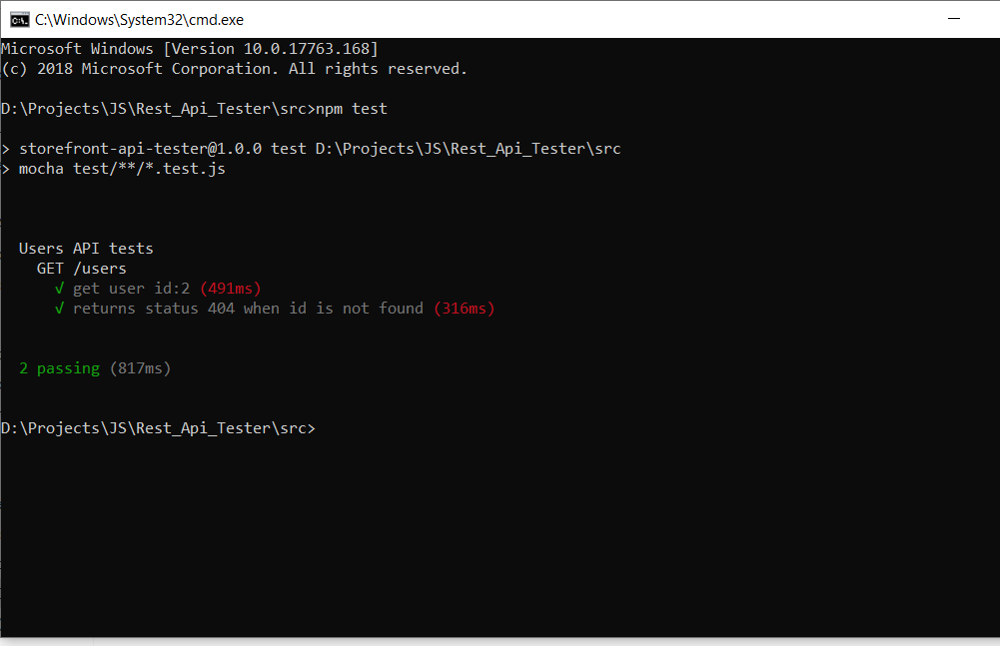

# REST API Tester
This node js application uses mocha & chai to test the rest API services


## Prerequisites
* Node.js (10.*) LTS

## Setup
In command line run the following while inside `src/`
```
npm install
```
## Test reporter
To change test reporters go to `src/test/mocha.opts`
More reporter options at https://mochajs.org/#reporters
```
--reporter mocha-allure-reporter
or
--reporter spec
```

## Run tests
```
npm test
```



## Generate html report
```
npm run report
```

## Plugins used
* Mocha - Test framework
* Chai - Assertion library
* Allure - Test report generation
* Request - Make async http request